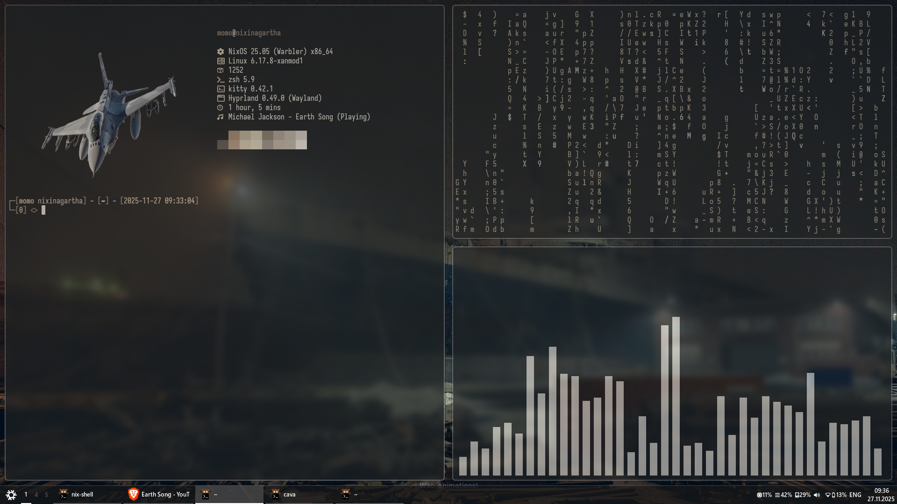

# urban-hyprland-dots
My dotfiles for my 'Urban' config

Credits to the waybar creator: https://github.com/TheFrankyDoll for his Win-10 waybar :)

Requirements:
* Kitty
* Hyprpaper
* Hyprland (ofc)
* Waybar
* Rofi
* Zsh
* OhMyZsh
* NixOS (Optional, alot of this stuff is tuned for it)

